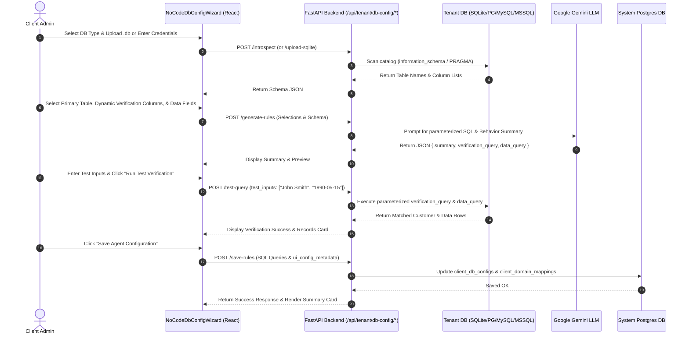

# Database Auto-Discovery & AI Rule Configurator

## Executive Overview

The **Database Auto-Discovery & AI Rule Configurator** allows SaaS client administrators (healthcare providers, logistics managers, e-commerce vendors, insurance agents) to connect their existing external database **without writing a single line of SQL code**.

The system automatically scans database tables and columns across multiple database engines (SQLite, PostgreSQL, MySQL, SQL Server), presents non-technical UI checklists for caller identity verification and data retrieval, and utilizes **Google Gemini** to synthesize parameterized, dialect-optimized SQL queries and plain-English voice agent rules.

---

## Key Features & Capabilities

### 1. Multi-Dialect Schema Scanning & SQLite File Upload
- **Catalog Scanning**: Queries `information_schema.columns` (PostgreSQL / MySQL / SQL Server) and `PRAGMA table_info` (SQLite) to discover all user tables and columns automatically.
- **SQLite `.db` File Upload**: Non-technical users can upload SQLite `.db` or `.sqlite` files directly via an interactive drag-and-drop widget. Uploaded files are saved to `uploads/db_files/` while maintaining clean, user-friendly file badges (`Selected File: order_tracking_client.db`) without exposing raw internal file paths.
- **On-Demand Lifecycle**: Dynamically opens and closes isolated connections per tenant request.

### 2. 100% Domain- & Schema-Agnostic Design
- **Zero Static Terminology**: Completely domain-independent. Does not hardcode industry terms (such as "Customer", "Patient", "Appointment").
- **Dynamic Table & Column Selection**:
  - **Primary Identity Table**: The table containing caller records (e.g. `tbl_patients`, `users`, `accounts`, `clients`).
  - **Related Details Table**: The table containing records callers ask about (e.g. `appointments`, `orders`, `policies`, `claims`).
  - **Dynamic Verification Checklist**: Automatically extracts and displays all columns from the selected Primary Identity table as checkboxes (e.g. `full_name`, `date_of_birth`, `policy_number`, `national_id`).
  - **Accessible Fields Checklist**: Checkbox selector for columns the Voice Agent is permitted to speak during calls.

### 3. AI-Powered Rule & Query Generation
- **Google Gemini Integration**: Uses `google.genai` (`gemini-2.5-flash` / `gemini-3.5-flash`) to translate visual UI selections into parameterized SQL queries and natural language instructions.
- **Dialect-Specific Parameter Placeholders**:
  - PostgreSQL: `$1, $2, $3, ...`
  - SQLite, MySQL, SQL Server: `?`
- **Ordered Filter Enforcement**: Ensures `WHERE` clause parameters match the exact sequence of selected UI verification fields.
- **Plain-English Summary**: Generates a 2-sentence summary explaining how the voice agent will identify callers and what records it will look up.

### 4. Interactive Live Test Connection Widget
- **Dynamic Sample Inputs**: Automatically renders test input boxes corresponding to the user's selected verification columns.
- **Case-Insensitive & Type-Safe Execution**:
  - Converts string parameters to lowercase for `LOWER(column) = $1` matches.
  - Automatically parses ISO date strings (`YYYY-MM-DD`) and compact dates (`YYYYMMDD`) into `datetime.date` objects for PostgreSQL type binding.
  - Features an automatic fallback retry mechanism if type mismatch occurs.
- **Live Preview**: Executes queries against the tenant's database and displays formatted JSON records for immediate verification before saving.

### 5. Non-Technical UX & Advanced Developer View
- **Collapsible Developer View**: Raw SQL queries (`verification_query` and `data_query`) are hidden inside a collapsible accordion for advanced developers.
- **Dashboard Read-Only Summary Card**: Displays an **Active Database Connection** summary card showing connection status, database settings, and AI rule mappings. Includes an **"Edit Configuration"** button to toggle the 3-step wizard flow whenever modifications are needed.

---

## 3-Step Wizard Flow

```
┌────────────────────────────────────────────────────────────────────────────────┐
│ Step 1: Connection & Auto-Discovery                                           │
│ ‣ Select DB Engine (SQLite / PostgreSQL / MySQL / SQL Server)                  │
│ ‣ Upload .db file OR enter server host, port, db name, username, password      │
│ ‣ Click "Connect & Scan Schema"                                                │
└───────────────────────┬────────────────────────────────────────────────────────┘
                        │
                        ▼
┌────────────────────────────────────────────────────────────────────────────────┐
│ Step 2: Dynamic Visual Rule Configurator                                       │
│ ‣ Select Primary Identity Table & Related Details Table                        │
│ ‣ Select dynamic column checkboxes for Caller Verification Criteria            │
│ ‣ Select dynamic column checkboxes for Accessible Agent Data                   │
│ ‣ Click "Generate AI Agent Configuration"                                      │
└───────────────────────┬────────────────────────────────────────────────────────┘
                        │
                        ▼
┌────────────────────────────────────────────────────────────────────────────────┐
│ Step 3: AI Summary, Live Test & Save                                           │
│ ‣ View AI Natural Language Behavior Summary                                    │
│ ‣ Execute live test query with dynamic sample inputs & preview records         │
│ ‣ (Optional) Inspect Collapsible Advanced Developer SQL View                   │
│ ‣ Click "Save Agent Configuration"                                             │
└────────────────────────────────────────────────────────────────────────────────┘
```

---

## Architecture & Code Map

### Backend Modules

| File Path | Description / Key Functions |
|---|---|
| [`app/dynamic_db_client.py`](file:///d:/Live%20Project/AI%20Voice%20Agent/AI-Voice-Agent/app/dynamic_db_client.py) | • `introspect_schema()`: Catalog scanner for SQLite, PostgreSQL, MySQL, SQL Server.<br>• `execute_query()`: Executes parameterized queries with type conversion and string fallback.<br>• Date parsing (`YYYY-MM-DD` and `YYYYMMDD` to `datetime.date`). |
| [`app/api/routes.py`](file:///d:/Live%20Project/AI%20Voice%20Agent/AI-Voice-Agent/app/api/routes.py) | • `POST /api/tenant/upload-sqlite`: Handles SQLite `.db` file uploads.<br>• `POST /api/tenant/db-config/introspect`: Runs catalog schema scanning.<br>• `POST /api/tenant/db-config/generate-rules`: Calls Gemini for query synthesis.<br>• `POST /api/tenant/db-config/test-query`: Executes test queries with live inputs.<br>• `POST /api/tenant/db-config/save-rules`: Persists configuration & UI metadata. |
| [`app/system_database.py`](file:///d:/Live%20Project/AI%20Voice%20Agent/AI-Voice-Agent/app/system_database.py) | • `ui_config_metadata TEXT` column in `client_domain_mappings` table.<br>• `update_client_domain_mapping()` and `get_client_domain_mapping()`. |

### Frontend Modules

| File Path | Description / Key Components |
|---|---|
| [`frontend/src/components/NoCodeDbConfigWizard.tsx`](file:///d:/Live%20Project/AI%20Voice%20Agent/AI-Voice-Agent/frontend/src/components/NoCodeDbConfigWizard.tsx) | Reusable 3-step wizard component containing file upload, dynamic column checkboxes, Gemini rule generation trigger, live test connection widget, and developer SQL accordion. |
| [`frontend/src/pages/DashboardPage.tsx`](file:///d:/Live%20Project/AI%20Voice%20Agent/AI-Voice-Agent/frontend/src/pages/DashboardPage.tsx) | Displays active database configuration summary card with connection status badge, database settings, rule mapping summary, and an "Edit Configuration" toggle button. |
| [`frontend/src/pages/RegisterPage.tsx`](file:///d:/Live%20Project/AI%20Voice%20Agent/AI-Voice-Agent/frontend/src/pages/RegisterPage.tsx) | Onboarding flow integrating the configurator wizard into new tenant sign-up. |
| [`frontend/src/services/tenantService.ts`](file:///d:/Live%20Project/AI%20Voice%20Agent/AI-Voice-Agent/frontend/src/services/tenantService.ts) | Service wrapper methods (`uploadSqliteDb`, `introspectDb`, `generateRules`, `testQuery`, `saveRules`). |

---

## API Endpoints Reference

### 1. `POST /api/tenant/upload-sqlite`
Uploads an SQLite `.db` or `.sqlite` database file to the server.

- **Content-Type**: `multipart/form-data`
- **Response**:
```json
{
  "success": true,
  "db_name": "uploads/db_files/order_tracking_client.db",
  "message": "Database 'order_tracking_client.db' uploaded successfully."
}
```

---

### 2. `POST /api/tenant/db-config/introspect`
Scans the catalog of the target database and returns a map of all readable tables and their column lists.

- **Request Body**:
```json
{
  "db_type": "sqlite",
  "db_name": "uploads/db_files/order_tracking_client.db"
}
```
- **Response**:
```json
{
  "success": true,
  "schema": {
    "customers": ["id", "full_name", "date_of_birth", "email_address", "phone_number"],
    "orders": ["order_id", "customer_id", "order_status", "delivery_date", "total_amount"]
  }
}
```

---

### 3. `POST /api/tenant/db-config/generate-rules`
Sends schema metadata and user selections to Google Gemini (`gemini-2.5-flash` / `gemini-3.5-flash`) to synthesize SQL queries and natural language instructions.

- **Request Body**:
```json
{
  "db_config": {
    "db_type": "postgresql",
    "db_name": "healthcare_db",
    "server_name": "localhost",
    "port": 5432
  },
  "customer_table": "tbl_patients",
  "verification_fields": ["full_name", "date_of_birth"],
  "data_table": "tbl_appointments",
  "data_fields": ["doctor_name", "appointment_time", "status"],
  "schema_data": { ... }
}
```
- **Response**:
```json
{
  "success": true,
  "summary": "The voice agent will verify callers using full_name and date_of_birth on tbl_patients. Once verified, it will retrieve appointment details from tbl_appointments.",
  "verification_query": "SELECT id, full_name, date_of_birth FROM tbl_patients WHERE LOWER(full_name) = $1 AND date_of_birth = $2 LIMIT 1",
  "data_query": "SELECT doctor_name, appointment_time, status FROM tbl_appointments WHERE patient_id = $1"
}
```

---

### 4. `POST /api/tenant/db-config/test-query`
Executes generated verification and data queries with sample input values.

- **Request Body**:
```json
{
  "db_config": { "db_type": "postgresql", "db_name": "healthcare_db" },
  "verification_query": "SELECT id, full_name, date_of_birth FROM tbl_patients WHERE LOWER(full_name) = $1 AND date_of_birth = $2 LIMIT 1",
  "data_query": "SELECT doctor_name, appointment_time, status FROM tbl_appointments WHERE patient_id = $1",
  "test_inputs": ["John Smith", "1990-05-15"]
}
```
- **Response**:
```json
{
  "success": true,
  "verified": true,
  "message": "Verification successful! Found matching customer record.",
  "customer": { "id": 101, "full_name": "John Smith", "date_of_birth": "1990-05-15" },
  "records": [
    { "doctor_name": "Dr. Sarah Jenkins", "appointment_time": "2026-07-22 10:30:00", "status": "Confirmed" }
  ]
}
```

---

### 5. `POST /api/tenant/db-config/save-rules`
Persists DB connection settings, generated SQL queries, and UI metadata into PostgreSQL system database (`client_db_configs` and `client_domain_mappings`).

- **Request Body**:
```json
{
  "client_id": 4,
  "domain_id": 1,
  "db_config": { "db_type": "postgresql", "db_name": "healthcare_db" },
  "verification_query": "SELECT ...",
  "data_query": "SELECT ...",
  "ui_config_metadata": {
    "customerTable": "tbl_patients",
    "verificationFields": ["full_name", "date_of_birth"],
    "dataTable": "tbl_appointments",
    "selectedDataFields": ["doctor_name", "appointment_time", "status"]
  }
}
```
- **Response**:
```json
{
  "success": true,
  "message": "Database and AI voice agent rules saved successfully!"
}
```

---

## End-to-End Data Flow


