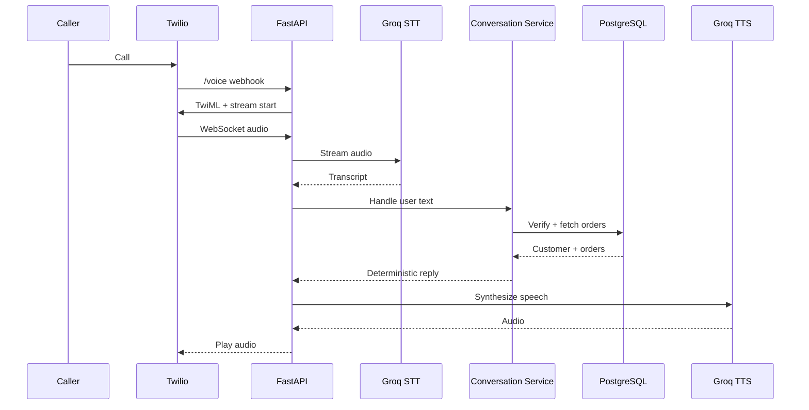
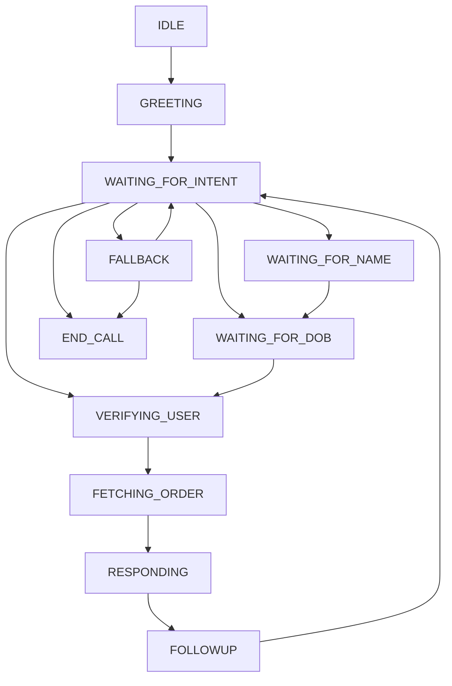

# Diagrams

## Sequence Diagram (Order Status)

```mermaid
sequenceDiagram
    participant Caller
    participant Twilio
    participant API as FastAPI
    participant STT as Groq STT
    participant Conv as Conversation Service
    participant DB as PostgreSQL
    participant TTS as Groq TTS

    Caller->>Twilio: Call
    Twilio->>API: /voice webhook
    API->>Twilio: TwiML + stream start
    Twilio->>API: WebSocket audio
    API->>STT: Stream audio
    STT-->>API: Transcript
    API->>Conv: Handle user text
    Conv->>DB: Verify + fetch orders
    DB-->>Conv: Customer + orders
    Conv-->>API: Deterministic reply
    API->>TTS: Synthesize speech
    TTS-->>API: Audio
    API-->>Twilio: Play audio

```

## Flow Diagram (State Machine)

```mermaid
flowchart TD
    IDLE --> GREETING
    GREETING --> WAITING_FOR_INTENT
    WAITING_FOR_INTENT --> WAITING_FOR_NAME
    WAITING_FOR_INTENT --> WAITING_FOR_DOB
    WAITING_FOR_INTENT --> VERIFYING_USER
    WAITING_FOR_NAME --> WAITING_FOR_DOB
    WAITING_FOR_DOB --> VERIFYING_USER
    VERIFYING_USER --> FETCHING_ORDER
    FETCHING_ORDER --> RESPONDING
    RESPONDING --> FOLLOWUP
    FOLLOWUP --> WAITING_FOR_INTENT
    WAITING_FOR_INTENT --> END_CALL
    WAITING_FOR_INTENT --> FALLBACK
    FALLBACK --> WAITING_FOR_INTENT
    FALLBACK --> END_CALL
```
