# Latency Investigation Report - Cascaded Voice Agent

Based on the deep instrumentation and micro-timing analytics captured during the most recent test run (`CA8c4968445b551487710a37048b4b72e1`), here is the exact breakdown of where latency is being introduced in the system.

## Section 1: End-to-End Timeline (First Turn Example)

| Event | Timestamp | Gap (Duration) |
|-------|-----------|----------------|
| **User Finished Speaking** | `17:09:19.531` | 0 ms |
| **STT Final Transcript Ready** | `17:09:20.186` | **655 ms** (Network/Deepgram) |
| **Queue Wait End (Processing Start)** | `17:09:20.186` | 0 ms |
| **Memory Retrieval Start** | `17:09:20.186` | 0 ms |
| **State Update End** | `17:09:20.187` | 1 ms |
| **LangGraph Invoke** | `17:09:20.187` | 0 ms |
| **Serialization & Prompt Formatting** | `17:09:20.255` | **68 ms** |
| **HTTP Request Sent** | `17:09:20.255` | 0 ms |
| **First Byte from Groq** | `17:09:20.666` | **411 ms** (TTFT) |
| **First Text Chunk Sent to Cartesia** | `17:09:20.670` | 4 ms |
| **First Audio Packet to Twilio** | `17:09:20.857` | **187 ms** (Cartesia TTFA) |

## Section 2: STT to LLM Gap Investigation

The gap between STT finishing (`20.186`) and the HTTP Request being sent (`20.255`) is exactly **69 ms**. 
**Where is this time spent?**
- **Queue Wait & State Retrieval:** < 1 ms. `asyncio` task scheduling is instantaneous.
- **Memory & LangGraph Checkpointer:** 1 ms.
- **Serialization & Token Counting:** **68 ms**. The vast majority of the "Application Overhead" is spent inside `_agent_node` executing the LangGraph node logic, formatting the system prompt, and generating the `messages` array payload for the HTTP request.

## Section 3: Async Scheduling & Memory Analysis

- **Asyncio Idle Delay**: None. The time between `tts_queue.put()` and `_tts_consumer` loop execution is strictly bound by event-loop ticks (<< 1 ms).
- **Session Manager Latency**: None. `self._sessions.get_or_create()` takes less than 1 millisecond. Memory operations are not blocking the pipeline.

## Section 4: Final Findings (Ranked Latency Contributors)

1. **Deepgram STT (Network + Inference):** ~655 ms (Massive bottleneck)
2. **Groq LLM (TTFT):** ~411 ms
3. **Cartesia TTS (TTFA):** ~187 ms
4. **Application Overhead (LangGraph/Serialization):** ~69 ms

## Flame Graph Visualization

```mermaid
gantt
    title Turn 1 Exact Millisecond Trace
    dateFormat x
    axisFormat %L
    
    User Finished: 0, 0
    Deepgram STT: 0, 655
    App Overhead: 655, 724
    Groq LLM TTFT: 724, 1135
    Cartesia TTS: 1135, 1322
    Twilio Playback: 1322, 1326
```

> [!CAUTION]
> **Conclusion:** The application logic (LangGraph, memory, serialization) is incredibly optimized and accounts for barely ~69ms of overhead. The massive delay is originating from the STT provider (Deepgram), which took over 650ms to yield a final transcript after the user stopped speaking. The second biggest bottleneck is Groq TTFT (411ms).
