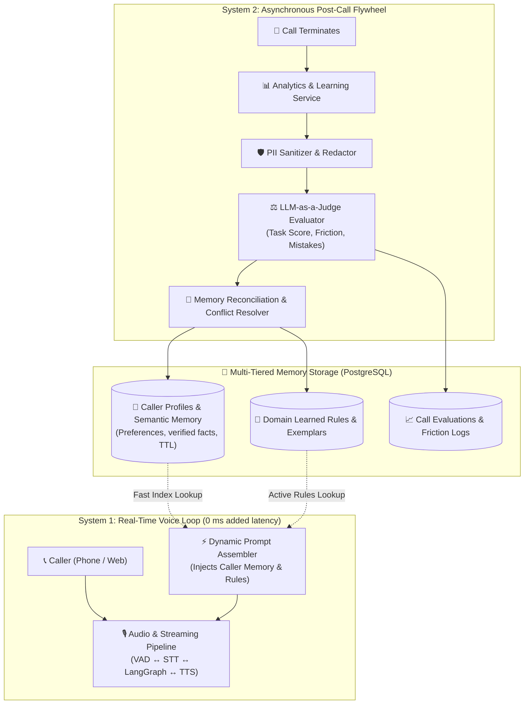

# Implementation Plan: Continuous Learning Agent Integration

Integrate a **Continuous Learning System** into the AI Voice Agent platform. The architecture decouples real-time voice interaction from offline learning using a **Dual-Process Cognitive Architecture (System 1 vs. System 2)**:
- **System 1 (Real-Time Audio Loop):** Zero latency overhead (<600 ms response time); dynamically injects sanitized caller profile facts and active learned rules into system prompts.
- **System 2 (Post-Call Asynchronous Flywheel):** Asynchronously evaluates call transcripts using an LLM-as-a-Judge, sanitizes PII, resolves memory contradictions, extracts caller preferences, and updates procedural rules.



---

## User Review Required

> [!IMPORTANT]
> **Performance & Latency Safety Guarantee:**
> Continuous learning evaluations (LLM-as-a-Judge, fact extraction, and memory reconciliation) will execute **strictly asynchronously** in background tasks after the call session closes. Live phone calls will experience **0 ms added latency**.

> [!WARNING]
> **Data Privacy & Compliance (PII/PHI):**
> Before storing any extracted memory facts or call transcripts into long-term tables, all data will pass through an automated `PIISanitizer` to scrub sensitive data (credit cards, SSNs, passwords, authentication pins) in accordance with privacy compliance.

---

## Open Questions

1. **Procedural Rule Approval Workflow:**
   - Should newly discovered procedural rules/exemplars be automatically activated into system prompts immediately upon high confidence, or should they be placed in a `pending_review` status for admin approval in the dashboard?
2. **Memory Persistence Scope:**
   - Should caller profiles be identified primarily by `caller_phone` (for inbound telephony) or `verified_user_id` (post-identity verification)? *(Recommended: Support both via a unified `caller_identifier` lookup).*

---

## Proposed Changes

### 1. Database Layer (`SystemDatabase`)

#### [MODIFY] [system_database.py](file:///d:/AI-Voice-Agent/app/system_database.py)
* Add database migrations and table initializations:
  1. `caller_profiles` (or `caller_semantic_memory`):
     - `id SERIAL PRIMARY KEY`
     - `client_id INTEGER REFERENCES clients(id) ON DELETE CASCADE`
     - `domain_id INTEGER REFERENCES domains(id) ON DELETE CASCADE`
     - `caller_identifier VARCHAR(255) NOT NULL` (Phone number, email, or verified account ID)
     - `profile_data JSONB NOT NULL DEFAULT '{}'` (Extracted facts, preferences, communication style)
     - `created_at TIMESTAMPTZ DEFAULT NOW()`, `updated_at TIMESTAMPTZ DEFAULT NOW()`
     - `UNIQUE(client_id, domain_id, caller_identifier)`
  2. `call_evaluations`:
     - `id SERIAL PRIMARY KEY`
     - `session_id VARCHAR(100) REFERENCES call_logs(session_id) ON DELETE CASCADE`
     - `client_id INTEGER`, `domain_id INTEGER`
     - `task_completion_score INTEGER` (0-100)
     - `friction_score INTEGER` (1-5)
     - `tool_accuracy_score INTEGER` (0-100)
     - `mistakes_detected JSONB DEFAULT '[]'`
     - `actionable_lessons JSONB DEFAULT '[]'`
     - `created_at TIMESTAMPTZ DEFAULT NOW()`
  3. `domain_learned_rules` (Procedural Memory):
     - `id SERIAL PRIMARY KEY`
     - `client_id INTEGER`, `domain_id INTEGER`
     - `rule_category VARCHAR(100)` (e.g., `verification_flow`, `objection_handling`, `tool_parameter_accuracy`)
     - `trigger_condition TEXT NOT NULL`
     - `instruction TEXT NOT NULL`
     - `confidence_score FLOAT DEFAULT 1.0`
     - `status VARCHAR(50) DEFAULT 'active'` (`active`, `pending_review`, `archived`)
     - `created_at TIMESTAMPTZ DEFAULT NOW()`
* Add CRUD helper methods: `get_caller_profile`, `upsert_caller_profile`, `save_call_evaluation`, `get_active_learned_rules`, `upsert_learned_rule`.

---

### 2. Memory Subsystem (`app/memory/`)

#### [NEW] [__init__.py](file:///d:/AI-Voice-Agent/app/memory/__init__.py)
* Package initialization for the memory subsystem.

#### [NEW] [pii_sanitizer.py](file:///d:/AI-Voice-Agent/app/memory/pii_sanitizer.py)
* Regex-based and heuristic sanitizer to scrub credit cards, CVVs, Social Security numbers, date-of-birth PINs, and auth secrets from transcripts before LLM reflection and storage.

#### [NEW] [evaluator_judge.py](file:///d:/AI-Voice-Agent/app/memory/evaluator_judge.py)
* Implement **LLM-as-a-Judge** post-call evaluation engine.
* Runs after call completion via Groq/Gemini with structured JSON output:
  - Evaluates transcript against domain rubrics (Task Completion, Verification Hygiene, Friction, Tool Usage).
  - Extracts newly disclosed caller facts (`extracted_facts` with confidence and timestamps).
  - Identifies conversation failure points and extracts one-sentence procedural guidelines (`lessons_learned`).

#### [NEW] [memory_manager.py](file:///d:/AI-Voice-Agent/app/memory/memory_manager.py)
* Core orchestration for continuous learning:
  - **Memory Reconciliation:** Compares newly extracted facts with existing `caller_profiles` (e.g., handles address changes, superseding older contradictory facts with recency timestamps).
  - **Conflict Resolution & Decay:** Resolves conflicting statements using confidence weighting and timestamp recency.
  - **Rule Aggregation:** Consolidates recurring call lessons into `domain_learned_rules`.

---

### 3. Prompt Configuration & Templates

#### [MODIFY] [prompts.yaml](file:///d:/AI-Voice-Agent/app/config/prompts.yaml)
* Add evaluation rubrics and memory extraction prompts:
  - `evaluation.call_judge_rubric`: Systematic scoring prompt for LLM-as-a-Judge.
  - `evaluation.fact_extraction_rubric`: Entity and caller preference extraction rules.
  - `evaluation.lesson_synthesis_rubric`: Synthesis of actionable behavioral corrections.

---

### 4. Integration into Real-Time Pipeline & Async Post-Call Flow

#### [MODIFY] [dynamic_prompt_assembler.py](file:///d:/AI-Voice-Agent/app/services/dynamic_prompt_assembler.py)
* Extend prompt assembler to fetch and inject caller context:
  - Inject `<caller_profile>` (e.g., preferred name, delivery constraints, historical preferences).
  - Inject `<domain_learned_rules>` (active procedural rules discovered from previous calls).
  - Keep injection compact (bullet points under 150 tokens) to avoid bloating prompt context.

#### [MODIFY] [agent_service.py](file:///d:/AI-Voice-Agent/app/services/agent_service.py)
* Update session initialization to accept and pass `caller_identifier` and preload semantic profile.

#### [MODIFY] [analytics_service.py](file:///d:/AI-Voice-Agent/app/services/analytics_service.py)
* Extend `process_call_analytics`:
  - After saving the standard call log, trigger `EvaluatorJudge` and `MemoryManager.process_post_call_learning` asynchronously.
  - Wrap in `try...except` so that any learning evaluation failure never affects standard analytics or database logging.

---

### 5. API & Management Endpoints

#### [MODIFY] [routes.py](file:///d:/AI-Voice-Agent/app/api/routes.py)
* Add REST endpoints for observability and continuous learning management:
  - `GET /api/call-evaluations/{session_id}`: Retrieve detailed LLM-as-a-Judge evaluation for a call.
  - `GET /api/caller-profiles/{caller_id}`: View caller's long-term semantic memory.
  - `GET /api/learned-rules`: List procedural rules learned by the agent across calls.
  - `PATCH /api/learned-rules/{rule_id}`: Approve, edit, or archive a learned rule.

---

## 4-Phase Delivery Schedule

| Phase | Focus Area | Deliverables | Est. Timeline |
| :--- | :--- | :--- | :--- |
| **Phase 1** | **Data Models & Semantic Memory** | System DB tables, `PIISanitizer`, `caller_profiles` CRUD, and prompt injection. | Days 1–3 |
| **Phase 2** | **LLM-as-a-Judge Evaluator** | `EvaluatorJudge` engine, YAML evaluation rubrics, post-call automated scoring. | Days 4–6 |
| **Phase 3** | **Memory Reconciliation & Flywheel** | `MemoryManager` conflict resolution, post-call background integration in `AnalyticsService`. | Days 7–9 |
| **Phase 4** | **Procedural Rules & Dashboard APIs** | Learned rule consolidation, Admin API endpoints, and end-to-end verification. | Days 10–13 |

---

## Verification Plan

### Automated Tests
1. **PII Sanitizer Tests:**
   ```bash
   pytest tests/test_pii_sanitizer.py
   ```
   - Verify that credit card patterns, SSNs, and sensitive tokens are completely scrubbed.
2. **Evaluator Judge Structured Output Tests:**
   ```bash
   pytest tests/test_evaluator_judge.py
   ```
   - Verify that call transcripts produce valid JSON adhering strictly to the evaluation schema.
3. **Memory Reconciliation Tests:**
   ```bash
   pytest tests/test_memory_reconciliation.py
   ```
   - Test scenario: Call 1 sets address to "100 Main St"; Call 2 updates address to "55 Park Ave". Verify that outdated address is superseded and not duplicated.
4. **Prompt Assembly Integration Tests:**
   ```bash
   pytest tests/test_dynamic_prompt_assembler.py
   ```
   - Verify that `<caller_profile>` and `<domain_learned_rules>` are cleanly injected into system prompts without formatting syntax errors.

### Manual Verification
1. **End-to-End Voice Simulation:**
   - Simulate a caller requesting an order with a specific preference (e.g., "Always call my cell after 5 PM").
   - Hang up call and verify that the background worker generates evaluation scores and stores caller preferences in PostgreSQL.
   - Initiate a second call with the same caller phone number and verify that the agent greets the caller and knows their preference without re-asking.
