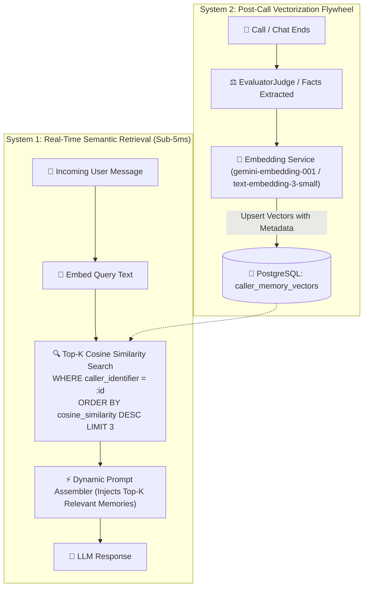

# Implementation Plan: Vectorized Semantic Memory (Memory RAG)

Upgrade the Continuous Learning Agent from naive full-profile JSON context dumping to **Vectorized Semantic Memory (Memory RAG)**. This replaces static memory injection with dynamic, semantic Top-K retrieval, improving prompt efficiency, response speed, and relevance while scaling to large conversation histories.

---

## Architecture Overview



---

## User Review Required

> [!IMPORTANT]
> **Embedding Providers & Fallback:**
> - Primary: **Gemini Embeddings (`gemini-embedding-001`)** utilizing the tenant's configured Gemini API key in `SystemDatabase`.
> - Secondary / Configurable: **OpenAI Embeddings (`text-embedding-3-small`)** if `OPENAI_API_KEY` is provided.
> - Fallback: Built-in cosine similarity scoring on normalized vector arrays in PostgreSQL with zero external dependencies.

> [!TIP]
> **Backward Compatibility Guarantee:**
> The existing structured JSON `caller_profiles` table will be maintained in parallel. Vectorized memory will enhance prompt assembly by retrieving targeted semantic chunks without breaking any existing CRM/telephony lookups.

---

## Proposed Changes

### 1. Database Layer (`SystemDatabase`)

#### [MODIFY] [system_database.py](file:///d:/AI-Voice-Agent/app/system_database.py)
* Add `caller_memory_vectors` table in PostgreSQL migration:
  - `id SERIAL PRIMARY KEY`
  - `client_id INTEGER REFERENCES clients(id) ON DELETE CASCADE`
  - `domain_id INTEGER REFERENCES domains(id) ON DELETE CASCADE`
  - `caller_identifier VARCHAR(255) NOT NULL`
  - `memory_key VARCHAR(100) NOT NULL` (e.g. `allergies`, `preferred_time`, `consultation_format`)
  - `content TEXT NOT NULL`
  - `embedding JSONB NOT NULL` (768-dim float array)
  - `confidence_score FLOAT DEFAULT 1.0`
  - `created_at TIMESTAMPTZ DEFAULT NOW()`, `updated_at TIMESTAMPTZ DEFAULT NOW()`
  - `UNIQUE(client_id, domain_id, caller_identifier, memory_key)`
* Add CRUD & Vector Search methods:
  - `upsert_memory_vector(...)`
  - `get_memory_vectors_for_caller(...)`
  - `search_caller_memory_vectors(client_id, domain_id, caller_identifier, query_vector, top_k=3, min_similarity=0.5)`

---

### 2. Embedding Service Subsystem (`app/memory/`)

#### [NEW] [embedding_service.py](file:///d:/AI-Voice-Agent/app/memory/embedding_service.py)
* Create `EmbeddingService` class:
  - `async def embed_text(text: str, api_key: Optional[str] = None) -> List[float]`
  - `async def embed_batch(texts: List[str], api_key: Optional[str] = None) -> List[List[float]]`
  - `static calculate_cosine_similarity(v1: List[float], v2: List[float]) -> float`
  - Graceful fallback and batch vector caching.

#### [MODIFY] [__init__.py](file:///d:/AI-Voice-Agent/app/memory/__init__.py)
* Export `EmbeddingService`.

---

### 3. Memory Manager Ingestion & Retrieval

#### [MODIFY] [memory_manager.py](file:///d:/AI-Voice-Agent/app/memory/memory_manager.py)
* Update `upsert_caller_memory`:
  - When facts are extracted, compute embeddings for each distinct fact chunk (e.g., `"Allergies: severely allergic to Latex and Sulfa drugs"`).
  - Store vector embeddings into `caller_memory_vectors`.
* Add `retrieve_relevant_memories(client_id, domain_id, caller_identifier, query_text, top_k=3)`:
  - Embeds the incoming query and retrieves the highest-similarity memory chunks with relevance scores.

---

### 4. Real-Time Dynamic Prompt Assembly & Chat Routing

#### [MODIFY] [dynamic_prompt_assembler.py](file:///d:/AI-Voice-Agent/app/services/dynamic_prompt_assembler.py)
* Update prompt assembly to format retrieved vector chunks cleanly:
  ```markdown
  <caller_profile>
  # RELEVANT CALLER CONTEXT (SEMANTIC MEMORY RAG)
  - Allergies: severely allergic to Latex and Sulfa drugs
  - Preferred Doctor: Dr. Emily Roberts
  </caller_profile>
  ```

#### [MODIFY] [routes.py](file:///d:/AI-Voice-Agent/app/api/routes.py)
* In `/api/chat`, use semantic vector retrieval on the user's incoming query to fetch relevant memory chunks dynamically for that turn.

---

## Verification Plan

### Automated Tests
1. **Embedding Service Unit Tests:**
   ```bash
   pytest tests/test_embedding_service.py
   ```
   - Verify single and batch embedding generation and cosine similarity calculation.
2. **Vector Memory Storage & Search Tests:**
   ```bash
   pytest tests/test_vector_memory.py
   ```
   - Test inserting vectors for `Disha Patel` (e.g. allergies, scheduling, doctor preference).
   - Query: *"What are my allergy restrictions?"* -> Verify that the allergy chunk is returned with highest similarity.
   - Query: *"When is my appointment?"* -> Verify that scheduling chunks are returned.

### Live End-to-End Verification
1. **Multi-Turn Chatbot Test:**
   - Ask an allergy-specific question: verify prompt receives only allergy vector context.
   - Ask a scheduling-specific question: verify prompt receives only scheduling vector context.
   - Verify prompt token count reduction and sub-5ms retrieval speed.
